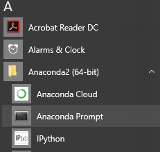

Text Editor
===========
A text editor is a simple notepad type application. For the DRI, we will be using the sublime text editor because it supports [syntax highlighting](https://en.wikipedia.org/wiki/Syntax_highlighting) and works on every operating system. 

**Download sublime:** [sublime](https://www.sublimetext.com/)

Command Line
============
**OSX:**: [How to install x-code command line tools](http://osxdaily.com/2014/02/12/install-command-line-tools-mac-os-x/)

**Windows**: [git-windows-tools](https://git-for-windows.github.io/)

Git
============
**OSX Install:** [git](https://git-scm.com/)

**Windows Install:** [git-windows-tools](https://git-for-windows.github.io/)

**Register:** [Github](https://github.com/)

Python
======
Download the Anaconda distribution of Python. This provides Python and the Jupyter notebook environment. 

**Download Python 3.5:** [Anaconda Python Distribution](https://www.continuum.io/downloads)

##References##
[Anaconda Cheet Sheet](http://conda.pydata.org/docs/using/cheatsheet.html)

[Jupyter Reference Sheet](https://damontallen.github.io/IPython-quick-ref-sheets/)

Databases
==========

**Download & Install:** [SQLiteStudio](http://sqlitestudio.pl/)

Open the [anaconda terminal](#How-to-open-an-anaconda-terminal) and install [sqlite](https://docs.python.org/2/library/sqlite3.html): 

`conda install sqlite -y`

Note: sqlite3 may be installed in Python by default.

Troubleshooting
===============
[How can I tell if Windows is 32 bit or 64 bit?](http://windows.microsoft.com/en-us/windows/32-bit-and-64-bit-windows#1TC=windows-7)

How to open an anaconda terminal: 
=================================
Windows:
-----------
### Via Search:

1) enter `Anaconda` into the search bar

2) click `Anaconda Prompt`:

### Via start:

1) go the the __start__ menu

2) Click `All apps` -> `Anaconda` -> `Anaconda Prompt` :

Mac:
----
Conda is built into the mac terminal, so you can follow the instructions for opening a shell:

### Via search:
1) Press `⌘(command)`and `spacebar`
2) Type `terminal`
3) Click on the terminal icon: 

### Via finder:

