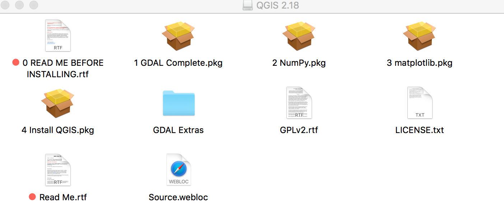

HTML & CSS
===================
**Install:** 
* [Chrome](https://www.google.com/chrome/browser/desktop/)
* [Sublime](https://www.sublimetext.com/)

Mapping
=======
Instructions are from [Michelle A. McSweeney](https://github.com/michellejm/Intro-QGIS-CUNY-FemSTEM/blob/master/Install-QGIS.md)

**Windows/Linux Install:** [QGIS](http://www.qgis.org/en/site/)
* Click on the 'QGIS standalone installer' and follow the prompts. 

**Mac OS/X:**
1. On a **Mac**, go to the [KyngChaos](http://www.kyngchaos.com/software/qgis) page.
	
2. Something like this will download
	
3. You MUST install the items **IN NUMERICAL ORDER**. It is very important to follow the numbers. 
4. Follow all of the prompts for all of the packages. 

**Launch** QGIS. Your new blank map project will look like this:

Note: The QGIS Python is independent of the Anaconda Python used throughout the DRI. You must install the QGIS numpy and matplotlib, even if they are already installed in your system. If you need QGIS to work with your system Python, come speak to the Digital Fellows during PUG or office hours or email gc.digitalfellows@gmail.com.

#### Troubleshooting

You may need to change [security & privacy settings](https://support.apple.com/en-us/HT202491) to allow app downloads from outside sources. 
