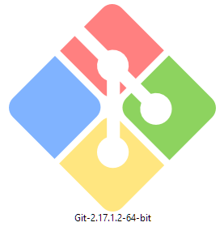
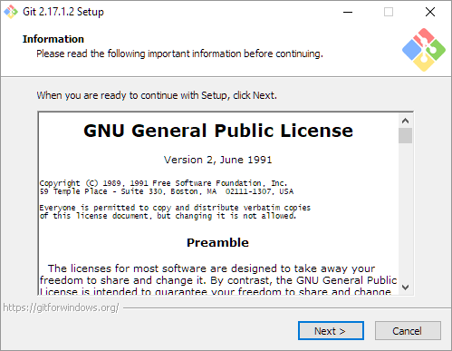
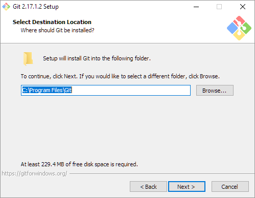
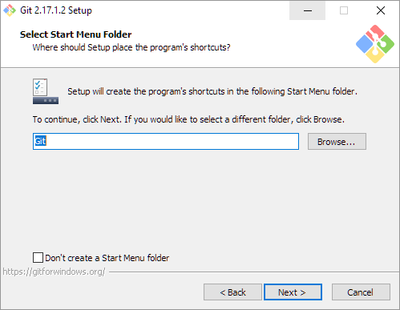
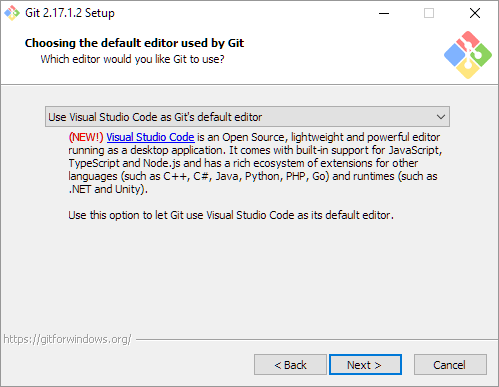
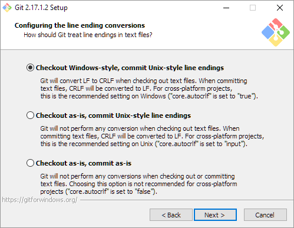
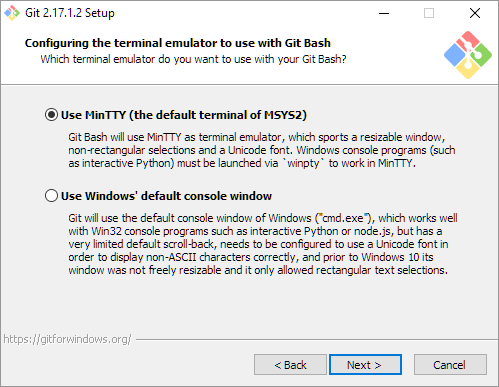
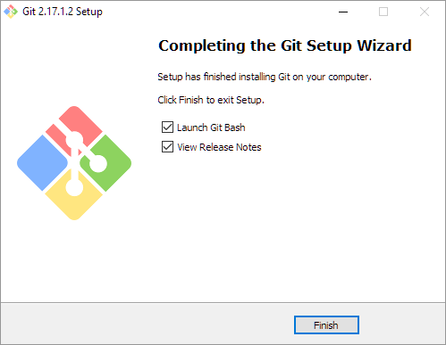

# Git
Git is a distributed version control system used to manage changes to text files. 

# OS/X

On OS/X, git is part of the xcode command line tools. To install them:

1. Open a [terminal](osx_terminal).

2. Type the following in the terminal:
```bash
xcode-select --install
```
3. [Test install](#test-install)

# Windows
As part of installing git, install the gitbash command line environment so that the command line is consistent across Windows, OSX and Linux.

1. Download git for windows:
https://git-scm.com/download/win

2. *Click* on the git installer:



3. Accept the license and *click* `Next`:

 

4. Select the installation folder, default is fine. *Click* `Next`:



5. Select the components to be installed, the default is fine: 


- Windows Only: select start menu folder (default is fine):



6. Choose the default editor used by Git. Select `Visual Studio Code` as the default editor. *Click* `Next`:



7. Choose the "Use Git from the Windows Command Prompt" radio button and then *click* `Next`:

 

9. Choose the HTTPS transport backend (the default is fine). *Click* `Next`: 


10. Configure the line ending conversions (the default is fine). *Click* `Next`:



11. On the 'configuring the terminal emulator to use with Git Bash' window, choose the "Use Windows default console window" option:



12. Configure the extra options (the defaults are fine). *Click* `Next`:


13. VSCode should now be installing:
 
 

14. *Click* through the rest of the install, leaving the defaults, and then *click* `Finish` on the last window: 



14. [Test install](#test-install)

## Test Install

Test that git is installed:

1. Open a [windows](windows_terminal.md) or [OS/X](osx_terminal.md) terminal. 

2. Type the following into the terminal:
```bash
 git
 ```

The terminal should print something like:

```bash
usage: git [--version] [--help] [-C <path>] [-c name=value]
           [--exec-path[=<path>]] [--html-path] [--man-path] [--info-path]
           [-p | --paginate | --no-pager] [--no-replace-objects] [--bare]
           [--git-dir=<path>] [--work-tree=<path>] [--namespace=<name>]
           <command> [<args>]


```
