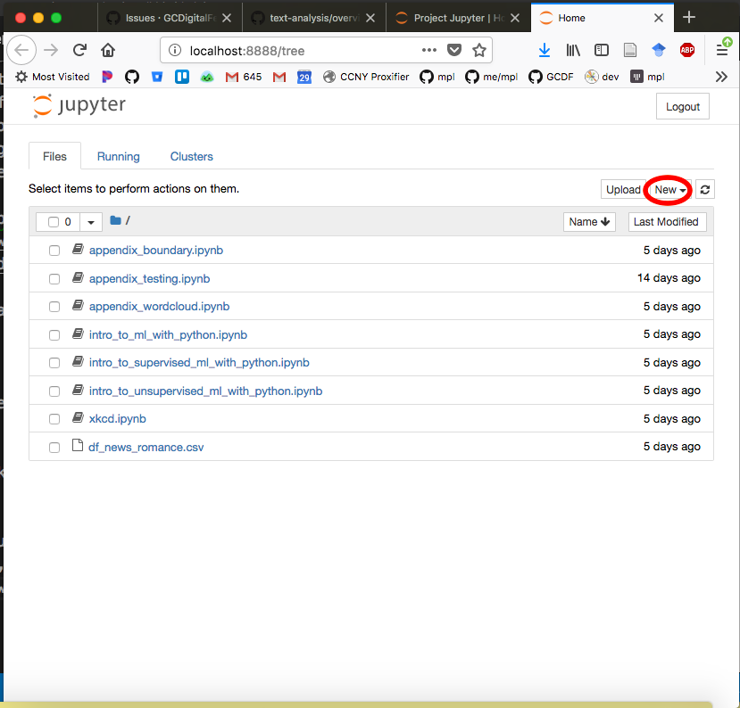
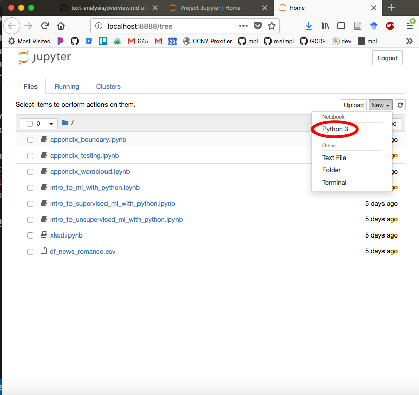
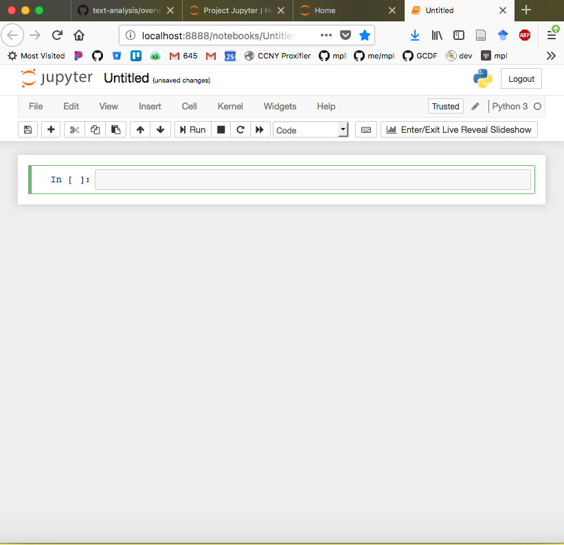
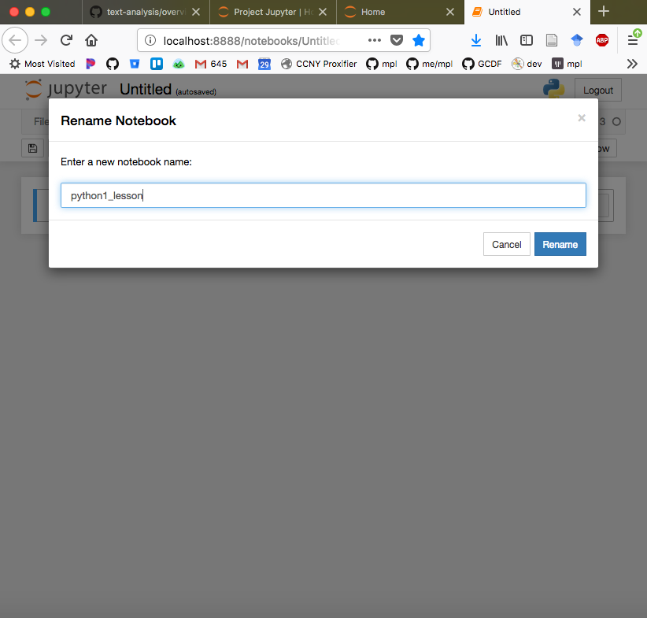
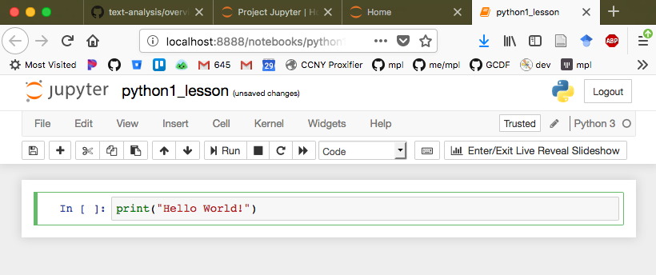
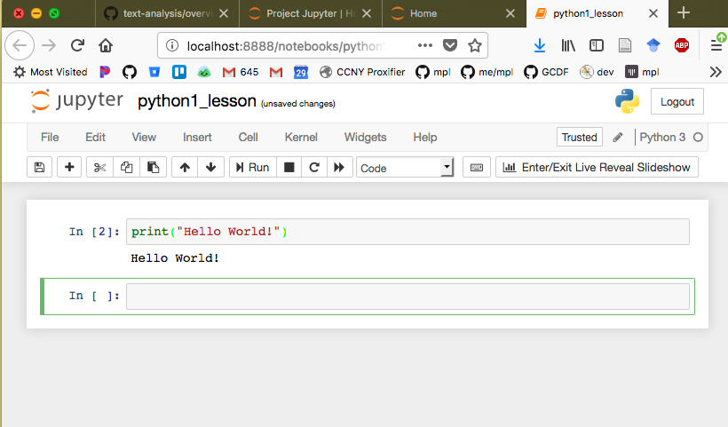
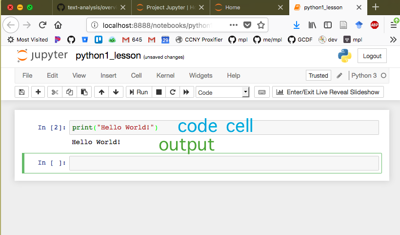

The [Jupyter](http://jupyter.org/) notebook is an open source semi language agnostic programming development environment aimed at simplifiying the creation and sharing of documents that contain live code, figures, and explanatory text. The Jupyter package is installed by default as part of the [Anaconda](python.md) environment and can be updated using the [conda](conda.md) package management system. 

## Executing Code in a Notebook
1. To open a jupyer notebook, first open a [windows](windows_terminal.md) or [OSX](osx_terminal.md) terminal. 

2. Via the command line, navigate to the folder in which  you would like to open the notebook. 

3. Then type the following in your terminal:
```bash
jupyter notebook
```

4. In your default web browser (e.g. Firefox, Chrome, or Safari), you should now see a window that looks like this.


5. To open a new notebook, navigate to the `New` drop down menu in the upper right corner and select `Python 3` from the new menu. 



6. This is what an empty Jupyter notebook looks like: 


7. Rename the notebook by *clicking* on the `Untitled` at the top of the page. That will spawn this window:



8. The light gray boxes are Python interpreter cells in which code can be executed. Here, we write the code `print("hello world"))`. 



9. To run the the code, we press `<shift>` + `<enter>`. The results are printed in the white cell underneath the code cell.



10. After a cell is executed, Jupyter notebook automatically adds a new cell underneath:


## Cell Menu

A Jupyter notebook consists of cells. Each cell can contain code or text. The menubar for managing these cells is at the top of the notebook under the file menu. Hovering over the menu items yields their function. The menubar looks like this:


icon | function
---- | --------
 | save the notebook
 | insert cell below
 | cut the selected cells
 | copy the selected cells
 | paste the selected cells
| move selected cells up
 | move selected cells down
 | execute code in cell
 | terminate execution of cell
 | restart notebook
 | restart notebook and execute all cells
 | type of cell (e.g. code, markdown, raw, etc)

Jupyter notebook also provides a set of keyboard shortcuts for managing these cells. You can read more about them at http://jupyter-notebook.readthedocs.io/en/stable/examples/Notebook/Notebook%20Basics.html#Keyboard-Navigation