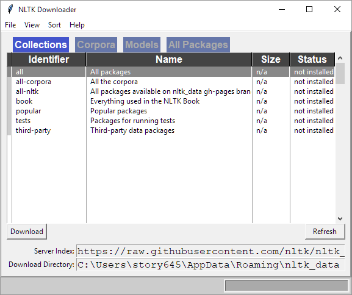

# NLTK 

[NLTK](http://www.nltk.org/) is the Natural Language Tool Kit. It is installed via the [conda](conda.md) package managment system and may already be installed in your environment.

## Install NLTK
1. Open a [Windows](windows_terminal.md) or [OSX](osx_terminal.md) terminal and type:

```
conda install nltk -y
```

2. The terminal should print something like the following:

```bash
Fetching package metadata .............
Solving package specifications: .

Package plan for installation in environment /Users/hannah/miniconda3/envs/installenv:

The following NEW packages will be INSTALLED:

    nltk: 3.3.0-py36_0
```

## NLTK Data

You then need to install the data that NLTK relies on to function. This may take several minutes (depending on your internet connection). Some packages may fail installation due to being outdated - this is alright, and will not be a problem for our lessons. If you get an error about a package failing, just shut down the install and move on to the [install test](#test-install).

1. Open a [Windows](windows_terminal.md) or [OSX](osx_terminal.md) terminal and type `python` to launch a Python interpreter. You should get something like this:
```python
Python 3.6.5 |Anaconda, Inc.| (default, Apr 26 2018, 08:42:37) 
[GCC 4.2.1 Compatible Clang 4.0.1 (tags/RELEASE_401/final)] on darwin
Type "help", "copyright", "credits" or "license" for more information.
>>> 
```
Alternatively, you can launch a [Jupyter Notebook](jupyter.md)

2. Load NLTK by typing the following in your environment and *pressing* 'enter':
```python
Python 3.6.5 |Anaconda, Inc.| (default, Apr 26 2018, 08:42:37) 
[GCC 4.2.1 Compatible Clang 4.0.1 (tags/RELEASE_401/final)] on darwin
Type "help", "copyright", "credits" or "license" for more information.
>>> import nltk
```

If this step fails, you need to [install NLTK](#install-nltk):

### Using the GUI
Load the NLTK GUI download tool: 

1. In your Python environment run the following command after import nltk:

```python
nltk.download()
```
For example, the interpreter above would now look like:
```python
Python 3.6.5 |Anaconda, Inc.| (default, Apr 26 2018, 08:42:37) 
[GCC 4.2.1 Compatible Clang 4.0.1 (tags/RELEASE_401/final)] on darwin
Type "help", "copyright", "credits" or "license" for more information.
>>> import nltk
>>> nltk.download()
```

2. Look for the NLTK download GUI - this will appear automatically but may appear hidden behind your browser window or behind where you are working in Python.


The Python environment that the GUI was launched from should now have a message that looks something like this:
```python
showing info https://raw.githubusercontent.com/nltk/nltk_data/gh-pages/index.xml
``` 

From here, you can choose what you would like to download. We recommend that you download everything by selecting `all`.
	
This may take several minutes (depending on your internet connection). *Press* the refresh button if the install is stalling and ignore errors. 

### Using the Command Line
NLTK also provides a text based download tool.  

1. In your open Python environment, type the following commands after importing nltk

```python
nltk.download('all', halt_on_error=False
```
For example, the interpreter above would now look like:
```python
Python 3.6.5 |Anaconda, Inc.| (default, Apr 26 2018, 08:42:37) 
[GCC 4.2.1 Compatible Clang 4.0.1 (tags/RELEASE_401/final)] on darwin
Type "help", "copyright", "credits" or "license" for more information.
>>> import nltk
>>> nltk.download('all', halt_on_error=False)
```
2. If the command is successful, the terminal will print out something like:
```python
[nltk_data] Downloading collection 'all'
[nltk_data]    | 
[nltk_data]    | Downloading package abc to
[nltk_data]    |     /usr/local/share/nltk_data...
[nltk_data]    |   Package abc is already up-to-date!
                ...omitted...
[nltk_data]    | Downloading package mwa_ppdb to
[nltk_data]    |     /usr/local/share/nltk_data...
[nltk_data]    |   Package mwa_ppdb is already up-to-date!
[nltk_data]    | 
[nltk_data]  Downloaded collection 'all' with errors
Out[2]: True
```

## Test Install
When the installation is complete, close the NLTK Downloader and check your installation. You need to be in a Python environment such as an interpreter or Jupyter notebook.

### Brown

In your Python environment, run the following code:

```python
from nltk.corpus import brown
``` 

If your code runs and nothing happens (no error message and nothing printed to the screen), congratulations! 

### Book
Check that the books corpus installed properly by typing:

```python
from nltk.book import *
```
If installed successfully, you should see the following:

```python
*** Introductory Examples for the NLTK Book ***
Loading text1, ..., text9 and sent1, ..., sent9
Type the name of the text or sentence to view it.
Type: 'texts()' or 'sents()' to list the materials.
text1: Moby Dick by Herman Melville 1851
text2: Sense and Sensibility by Jane Austen 1811
text3: The Book of Genesis
text4: Inaugural Address Corpus
text5: Chat Corpus
text6: Monty Python and the Holy Grail
text7: Wall Street Journal
text8: Personals Corpus
text9: The Man Who Was Thursday by G . K . Chesterton 1908
```

### Penn Parts of speech
Check that the parts of speech tagger is installed correctly by typing the following:

```python
nltk.help.upenn_tagset('NN')
```
If installed successfully, you should see the following:
```python
NN: noun, common, singular or mass
    common-carrier cabbage knuckle-duster Casino afghan shed thermostat
    investment slide humour falloff slick wind hyena override subhumanity
    machinist ...
```
