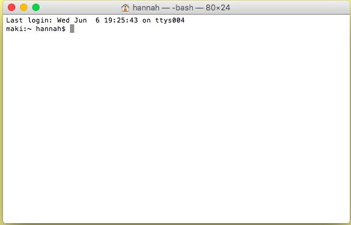

How to open a terminal: 
=======================

## Search:
1) Press `⌘(command)`and `spacebar`

2) Type `terminal`

3) Click on the terminal icon: 

## Finder:
1) Click on __finder__

2) Click `Applications` -> `Utilities` -> `Terminal`:

## OS/X Terminal
This is an example of what an OS/X terminal looks like (the colors may be different on your computer):

