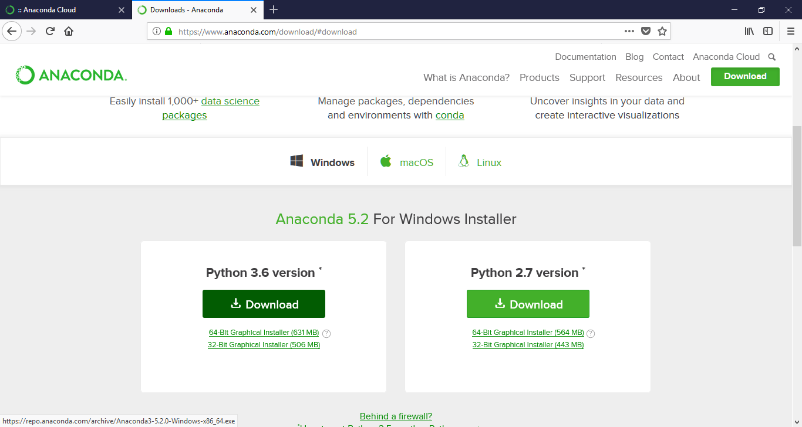
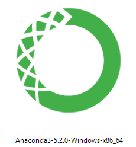
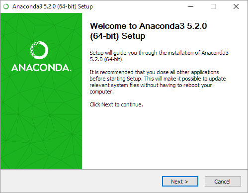
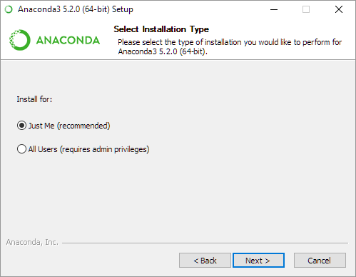
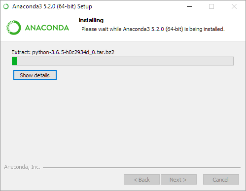

Download the [Anaconda](https://www.anaconda.com/download/) is distribution of Python. This provides a Python programming environment, the Jupyter notebook environment, and the [conda](conda.md) package management system. 

## Download Python 3.6: 

1. Go to https://www.anaconda.com/download/ 
 
 2. *Click* on the Python 3.6 button:



## Install

1. *Click* on the installer:



2. You should see the initial install screen. *Click* `Next`:
 
 

3. Keep clicking through the install until you reach this window. Install Anaconda only for yourself by choosing the just for me radio button. *Click* `Next`:



4. Keep clicking through using the defaults until you reach the Advanced Installation options. Select the "Register Anaconda as my default Python" check box. Then *click* `Next`: 


5. The installation may take a while, so go grab a snack or check email: 


6. *Click* `Skip` since VSCode is already installed: 


7. This is the final window. *Click* `Finish`:


## Test

Open a [windows](windows_terminal.md) or [OS/X](osx_terminal.md) terminal and type `python`. The terminal should print something like:
* OS/X:
    ```python
    Python 3.6.3 |Anaconda, Inc.| (default, Dec  5 2017, 17:30:25) 
    [GCC 4.2.1 Compatible Clang 4.0.1 (tags/RELEASE_401/final)] on darwin
    Type "help", "copyright", "credits" or "license" for more information.
    >>> 
    ```
* Windows: 

    ```python
    Python 3.6.5 |Anaconda, Inc.| (default, Mar 29 2018, 13:32:41) [MSC v.1900 64 bit (AMD64)] on win32
    Type "help", "copyright", "credits" or "license" for more information.
    >>> 
    ```


## References ##

* [Anaconda Cheet Sheet](http://conda.pydata.org/docs/using/cheatsheet.html)

* [Jupyter Reference Sheet](https://damontallen.github.io/IPython-quick-ref-sheets/)

