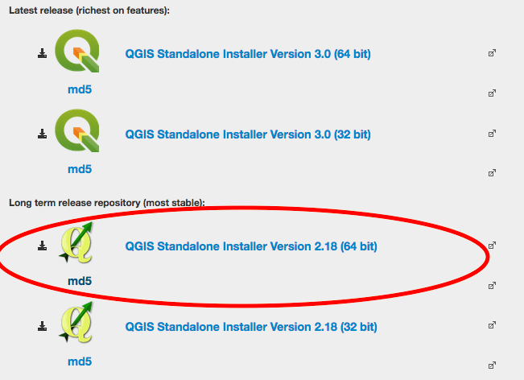
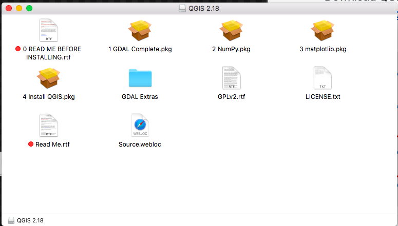

# QGIS

[QGIS](http://www.qgis.org/en/site/) is a free and open source Geographical Information System. 

## Download
* Download __QGIS Version 2.18__ from https://qgis.org/en/site/forusers/download.html:

## Windows Install:

1. [Download](#download)

2. Follow the instructions provided by the installer you downloaded.  

3. [Test install](#test-install)

## Mac OS/X:

1. [Download](#download)

2. When you click on the installer, you will see this page:

 You MUST install the items **IN NUMERICAL ORDER** using the provided installers:

1. GDAL
2. NumPy
3. Matplotlib
4. QGIS

The QGIS Python is independent of the Anaconda Python used elsewhere. You must install the QGIS numpy and matplotlib, even if they are already installed in your system. If you need QGIS to work with your system Python, please follow the listed instructions and then speak to the instructor privately.

3. [Test install](#test-install)

#### Troubleshooting
You may need to change [security & privacy settings](https://support.apple.com/en-us/HT202491) to allow app downloads from outside sources.

## Test Install
 Launch __QGIS 2.18 Desktop 2.18.20__. A new project will look like this:

Instructions are modified from [Michelle A. McSweeney](https://github.com/michellejm/Intro-QGIS-CUNY-FemSTEM/blob/master/Install-QGIS.md)

