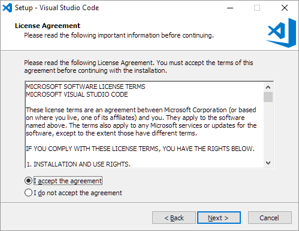
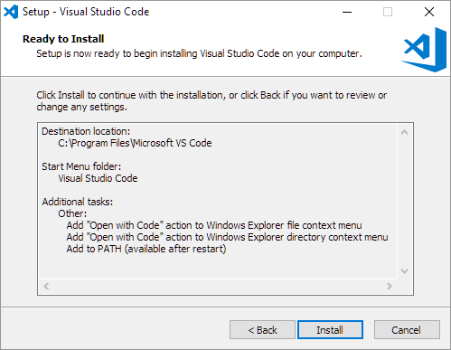
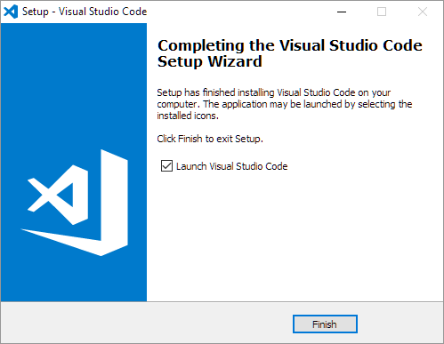
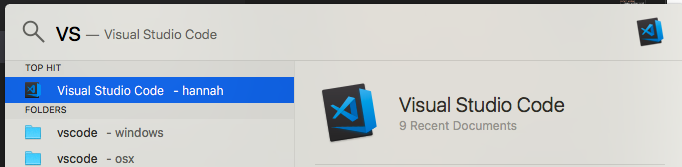
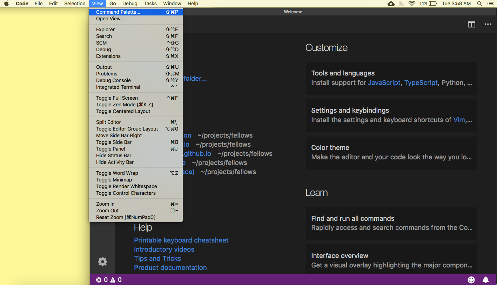

For our workshops, we will be using Visual Studio Code. Not only is Visual Studio Code free and open source, but it is also consistent across OSX, Windows, and Linux systems.

# VSCode
1. *Click* on the VScode installer in your downloads folder:

2. When you see this window, *click* `Next`:
 
 
 3. Accept the license agreement by *selecting* the first radio button. Then *click* `next`  
 
 4. Choose the folder on the computer that VSCode should be installed in (the default is usually fine). Then *click* `Next`:
 
 
 4b. Windows only: Choose the folder in the start menu that VSCode should be installed in. Then *click* `Next`:
 
 
 4c. Windows only: *check* the box that says `Add to PATH`, which is the fifth (last) box. All the other boxes are optional. Then *click* `Next`:
 

6. You should see a window listing the configurations you chose in the previous steps. If they are incorrect, *click* `Back` and redo the previous steps. If they are correct, *click* `Install`
 

7. Sit back and relax because the install will take a while. You should see a window with a progress bar similar to this:
 

8. *Check* the "Launch Visual Studio Code" checkbox and then *click* `Next`

9. VSCode should now be installed. You should see something like this window when you launch VSCode:

# Adding VSCode to PATH in OSX
 To be able to open code from the osx terminal, we need to [add it to path](https://code.visualstudio.com/docs/setup/mac). 

1. Open VSCode via your preferred method (applications folder or search bar.) *Clock* on the icon:

2. Navigate to the `View->Command Pallet` menu and *click* on `command`

3. Command pallet looks like this. *Type* `shell` into the text bar. Then choose "Shell Command: Install `code` command in PATH" 

4. Once the install is finished, you should be able to open a [terminal](osx_terminal.md) and *type* `code` and that should launch VSCode
