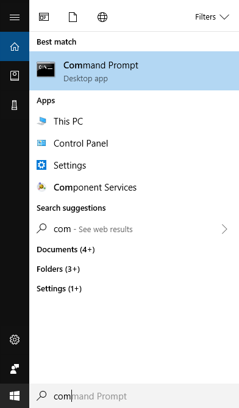
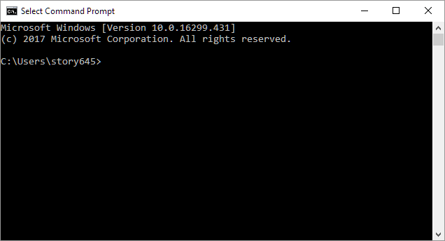
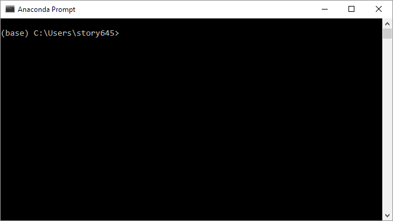

How to open a terminal: 
=======================

Windows:
-----------
In Windows, there are two terminal options: command prompt and anaconda prompt.

## Command Prompt

1. Enter `com` into the search bar. Then *click* the `Command Prompt` icon:

2. The Command Prompt will look like this:

## Anaconda
1) Navigate to the program:
    * __search__: enter `Anaconda` into the search bar.

    * __start menu__:`All apps` -> `Anaconda` -> `Anaconda Prompt` 

2) *Click* `Anaconda Prompt`:

3) You should see a window that looks like this:

